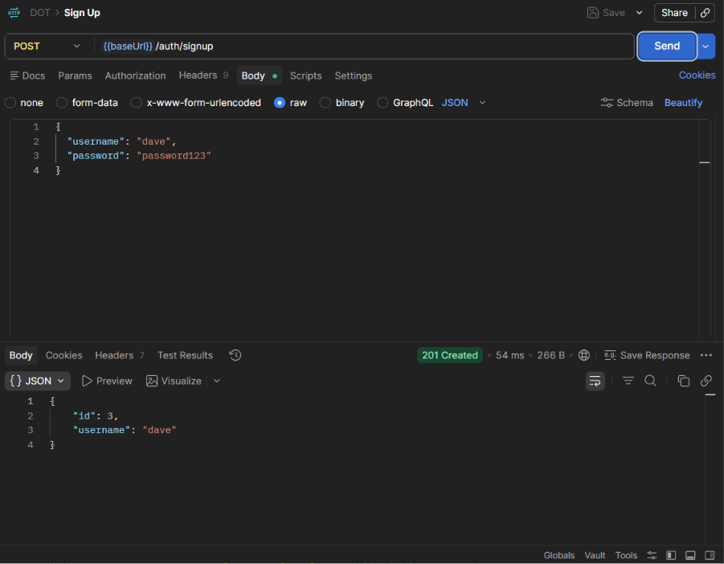
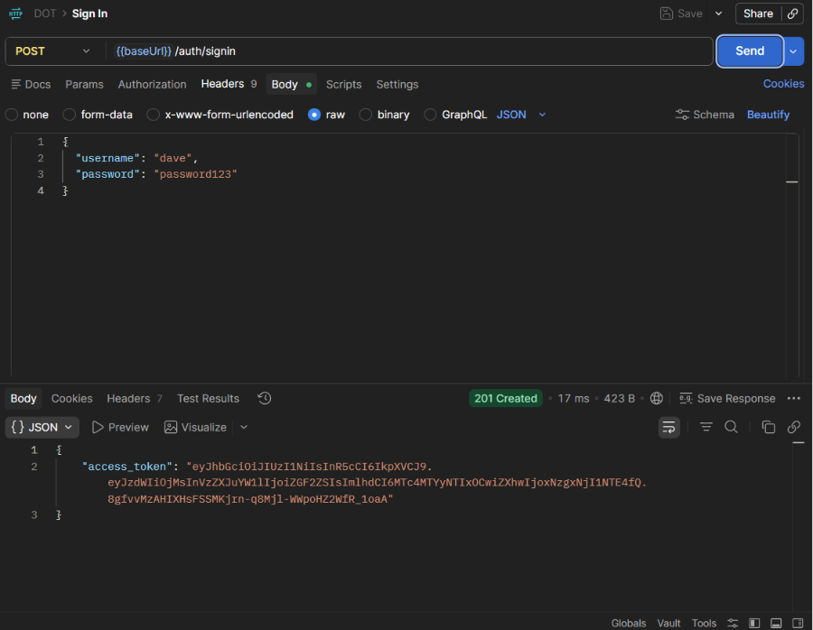
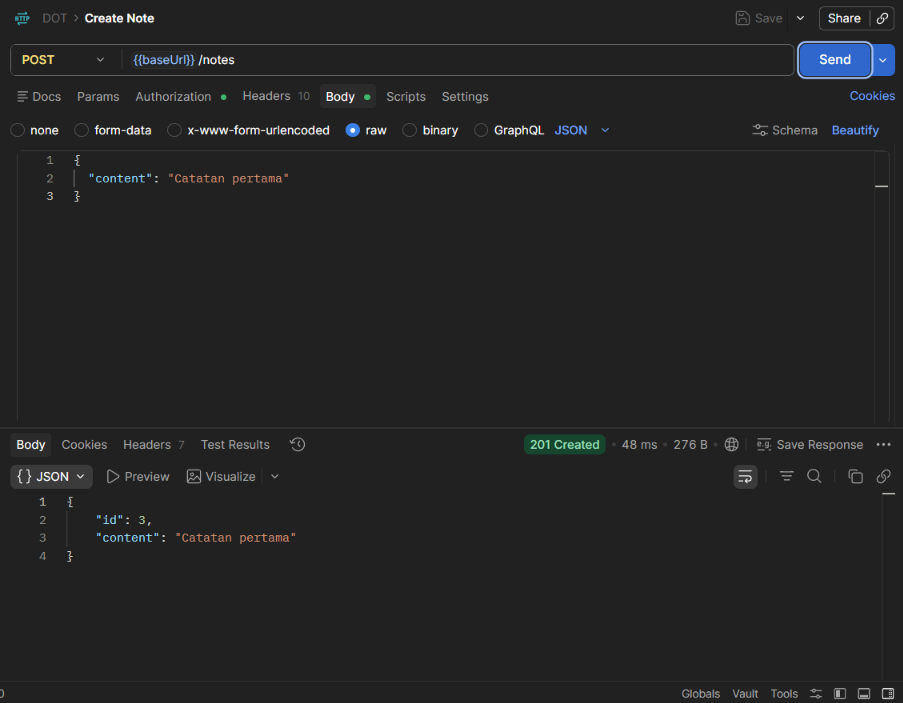
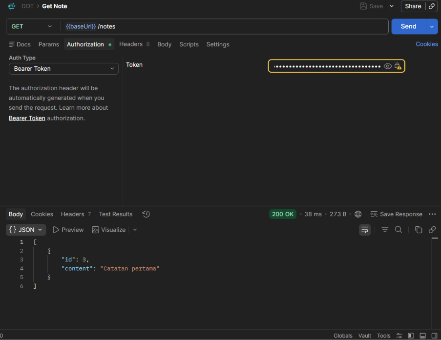
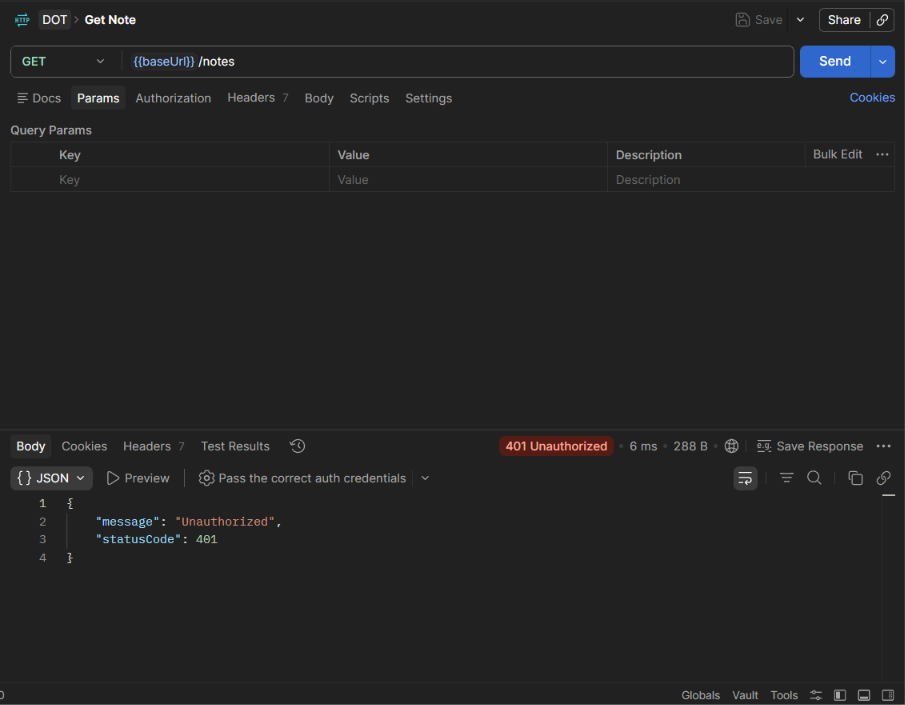

# DOT_test

Simple REST API menggunakan NestJS, TypeScript, PostgreSQL, TypeORM, dan JWT authentication.

## Fitur

- `POST /auth/signup` untuk membuat user
- `POST /auth/signin` untuk login dan mendapatkan JWT token
- `POST /notes` untuk membuat note milik user yang sedang login
- `GET /notes` untuk mengambil notes milik user yang sedang login

Relasi utama aplikasi ini adalah `User` memiliki banyak `Note`.

## Project Pattern

Project ini menggunakan feature-based modular pattern, yaitu kode dipisahkan berdasarkan fitur/domain:

- `auth` berisi controller, service, guard, DTO, dan konfigurasi JWT untuk authentication
- `users` berisi entity dan service untuk data user
- `notes` berisi controller, service, entity, dan DTO untuk notes

Pattern ini mirip dengan MVC yang biasa saya gunakan karena controller tetap bertugas menerima request HTTP, service berisi business logic, dan entity/model merepresentasikan struktur data. Bedanya, pada NestJS pembagian utamanya dibuat per fitur/module, sehingga file yang berhubungan dengan satu fitur berada di folder yang sama. Ini membuat project lebih mudah dikembangkan saat fitur bertambah.

## E2E Testing

E2E atau end-to-end testing adalah pengujian aplikasi dari sisi client melalui HTTP request, seperti user asli yang memakai API. Test ini memastikan controller, service, database, JWT token, dan auth guard bekerja bersama.

Test token API berada di:

```bash
test/app.e2e-spec.ts
```

Untuk menjalankan e2e test:

```bash
pnpm run test:e2e
```

Test tersebut melakukan:

1. Signup user
2. Signin user
3. Memastikan token JWT diterima
4. Memastikan `/notes` ditolak tanpa token
5. Membuat note memakai token
6. Mengambil notes memakai token

Pastikan PostgreSQL lokal aktif dan database `dot-test` tersedia sebelum menjalankan test.

## Dokumentasi API

Base URL:

```txt
http://localhost:3000
```

### POST /auth/signup

Membuat user baru.

Request body:

```json
{
  "username": "dave",
  "password": "password123"
}
```

Response `201 Created`:

```json
{
  "id": 3,
  "username": "dave"
}
```



### POST /auth/signin

Login user dan mengembalikan JWT access token.

Request body:

```json
{
  "username": "dave",
  "password": "password123"
}
```

Response `201 Created`:

```json
{
  "access_token": "jwt_token"
}
```



### POST /notes

Membuat note untuk user yang sedang login.

Authorization:

```txt
Bearer <access_token>
```

Request body:

```json
{
  "content": "Catatan pertama"
}
```

Response `201 Created`:

```json
{
  "id": 3,
  "content": "Catatan pertama"
}
```



### GET /notes

Mengambil semua notes milik user yang sedang login.

Authorization:

```txt
Bearer <access_token>
```

Response `200 OK`:

```json
[
  {
    "id": 3,
    "content": "Catatan pertama"
  }
]
```



### Error Response

Endpoint `/notes` wajib menggunakan JWT token. Jika token tidak dikirim atau tidak valid, API mengembalikan:

```json
{
  "message": "Unauthorized",
  "statusCode": 401
}
```


